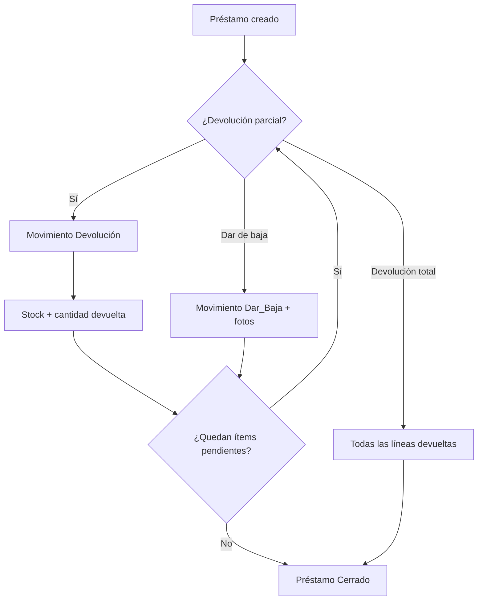
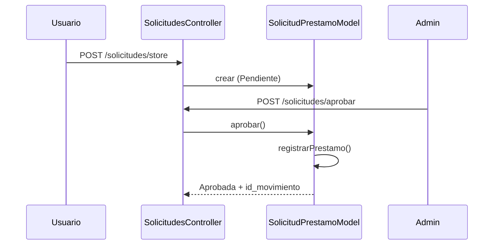

# Flujo de trabajo

## Ciclo de vida de una petición HTTP

```
Cliente
  │
  ▼
public/.htaccess  ──►  reescribe a index.php
  │
  ▼
public/index.php
  ├── Auth::startSession()
  ├── Migrator::run()
  ├── Router: registra rutas
  └── Router::dispatch(URI, METHOD)
        │
        ▼
  Controlador@accion()
        ├── Auth::requireLogin() / requireAdmin()  (si aplica)
        ├── Model: consultas / transacciones
        └── view() | redirect() | json() | headers CSV
```

### Ejemplo: listar inventario

1. `GET /inventario` → `InventarioController@index`.
2. `Auth::requireLogin()` en constructor o acción.
3. `InventarioModel` obtiene ítems con filtros `q` y `categoria`.
4. `view('inventario/index', [...])` renderiza tabla dentro de `main.php`.

### Ejemplo: crear elemento (admin)

1. `POST /inventario/store` → `InventarioController@store`.
2. `Auth::requireAdmin()`.
3. Validación en controlador; `InventarioModel::create()` con `Cantidad = 0`.
4. `setFlash('success', ...)` + `redirect('/inventario')`.
5. La vista muestra el alert Bootstrap con el flash.

## Autenticación y sesión

### Inicio de sesión

1. Usuario accede a `GET /login`.
2. Envía `POST` con `cedula` y `password`.
3. `UsuarioModel::findByCedula` + `password_verify`.
4. Se rechaza si `Estado !== 'Activo'`.
5. `Auth::login()` guarda sesión y redirige a `/dashboard`.

### Cierre de sesión

- `GET /logout` → `Auth::logout()` → redirección a login.

### Datos en sesión

```php
$_SESSION['user'] = [
    'cedula'  => '...',
    'nombres' => '...',
    'tipo'    => 'Admin' | 'Usuario',
];
```

## Roles y navegación

### Administrador (`Tipo = 'Admin'`)

Acceso completo desde el sidebar:

- Panel, Inventario, Categorías, Movimientos, Préstamos, Solicitudes (calendario), Reportes, Usuarios.

### Usuario (`Tipo = 'Usuario'`)

Sidebar reducido:

- Panel, Inventario (solo consulta), Nueva solicitud, Calendario, Mis solicitudes.

La visibilidad se controla en `app/views/layouts/main.php` con `Auth::isAdmin()`.

## Flujos de negocio principales

### 1. Alta y gestión de inventario

```
Admin crea elemento (Cantidad = 0)
        │
        ▼
Admin registra INGRESO de movimiento
        │
        ▼
Stock aumenta (InventarioModel::ajustarCantidad)
        │
        ▼
Elemento disponible para préstamos y solicitudes
```

- **Editar** metadatos (nombre, categoría, foto): permitido; cantidad no se edita en el formulario.
- **Eliminar:** borrado lógico (`Estado = 'Eliminado'`).

### 2. Movimiento de ingreso

**Ruta:** `/movimientos/ingreso` (solo Admin)

1. Seleccionar o crear líneas (`linea_codigo[]`, `linea_cantidad[]`).
2. `MovimientoModel::registrarIngreso()` crea cabecera + detalle.
3. Consecutivo automático por tipo `Ingreso`.
4. Stock incrementado por cada línea.
5. Documento imprimible en `/movimientos/ingreso/documento?id=...`.

### 3. Préstamo directo (admin)

**Ruta:** `/movimientos/prestamo`

1. Admin asigna `cedula_cuentadante` (usuario responsable).
2. Líneas de elementos y cantidades.
3. Validación de stock disponible.
4. `registrarPrestamo()` — stock disminuye.
5. Préstamo queda en estado `Activo` hasta devolución total o bajas.

### 4. Solicitud de préstamo (usuario)

```
Usuario crea solicitud (Pendiente)
        │
        ├──► Usuario puede cancelar (si Pendiente)
        │
        ▼
Admin revisa en /solicitudes/pendientes o calendario
        │
        ├── Aprobar ──► crea Movimiento Prestamo + vincula id_movimiento
        ├── Rechazar ──► requiere motivo
        └── (sin acción) ──► permanece Pendiente
```

**Aprobación:** `SolicitudPrestamoModel::aprobar()` ejecuta la lógica de préstamo y actualiza la solicitud a `Aprobada`.

### 5. Devolución de préstamo

**Rutas:** `/prestamos/devolucion`, `/prestamos/devolucion-total`

1. Se parte de un préstamo activo (`id_movimiento` padre).
2. Devolución parcial o total crea movimiento hijo `Devolucion` con `id_movimiento_ref`.
3. Stock se repone según cantidades devueltas.
4. `sincronizarEstadoPrestamo()` cierra el préstamo (`Estado = 'Cerrado'`) cuando no quedan ítems pendientes.

### 6. Dar de baja

**Ruta:** `/prestamos/dar-de-baja`

1. Desde un préstamo activo; ítems no devueltos.
2. Obligatorio: 1 a 3 fotografías de evidencia.
3. Crea movimiento `Dar_Baja` referenciado al préstamo.
4. No repone stock (pérdida definitiva del préstamo).
5. Documento imprimible disponible.

### 7. Gestión de usuarios

**Ruta:** `/usuarios` (Admin)

- CRUD sobre `Usuarios`; PK es `Cedula`.
- Contraseñas con `password_hash` / `password_verify`.
- No se puede eliminar la propia cuenta.
- Los usuarios activos son también los **cuentadantes** posibles en préstamos (unificación con antigua entidad Cuentadantes).

### 8. Categorías

**Ruta:** `/categorias` (Admin)

- CRUD con estado Activo/Inactivo/Eliminado.
- No se elimina una categoría con elementos asociados.

### 9. Reportes

**Ruta:** `/reportes` (Admin)

- Tipo `movimientos`: detalle por línea con filtros de fecha, tipo, cuentadante.
- Tipo `inventario`: stock con operadores de cantidad.
- Exportación CSV en `/reportes/export-csv`.

## Mensajes flash

Patrón estándar para operaciones de escritura:

```php
$this->setFlash('success', 'Elemento guardado correctamente.');
$this->redirect('/inventario');
```

En la vista:

```php
<?php if (!empty($flash)): ?>
<div class="alert alert-<?= htmlspecialchars($flash['type']) ?> ...">
```

Tipos habituales: `success`, `danger`, `info`, `warning`.

Los errores de login usan variable `$error` en la vista de auth (no flash).

## Subida de archivos

| Contexto | Controlador | Destino |
|----------|-------------|---------|
| Foto de inventario | `InventarioController::handleUpload()` | `uploads/inventario/{codigo}.{ext}` |
| Fotos dar de baja | `MovimientosController::handleDarBajaUploads()` | `uploads/dar-baja/baja_{id}_{time}_{i}.{ext}` |

Preview en formulario: `FileReader` en `public/js/app.js`.

## Exportación CSV

Disponible en:

- `/inventario/export-csv`
- `/movimientos/export-csv`
- `/reportes/export-csv`

Los controladores envían headers `Content-Type: text/csv` y contenido generado en PHP (sin vista de layout).

## Documentos imprimibles

Vistas dedicadas con `layout = null`:

- Ingreso, préstamo, devolución, dar de baja.

Incluyen botón "Imprimir PDF" (`window.print()`) y estilos `@media print`.

## JavaScript por módulo

| Archivo | Función |
|---------|---------|
| `app.js` | Nav activo, preview foto, modal de miniaturas |
| `ingreso.js` | Líneas dinámicas en ingreso |
| `prestamo.js` | Líneas y búsqueda en préstamo |
| `modal-busqueda.js` | Modales de selección de elementos/usuarios |
| `solicitud-prestamo.js` | Formulario de solicitud |
| `solicitudes-calendario.js` | Interacción del calendario |

## Diagrama: préstamo y cierre



## Diagrama: solicitud de préstamo



## Desarrollo y despliegue

### Arranque local típico

1. Importar `database/inventario_cm.sql` o crear BD y dejar que Migrator complete el esquema.
2. Ajustar `config/database.php` y `config/app.php`.
3. Apuntar el virtual host o alias a `public/`.
4. Acceder con usuario semilla `admin` / contraseña `123456` (cambiar en producción).

### Añadir un módulo nuevo

1. Registrar rutas en `public/index.php`.
2. Crear controlador en `app/controllers/`.
3. Crear modelo si hay persistencia.
4. Crear vistas en `app/views/{modulo}/`.
5. Añadir enlace en sidebar de `layouts/main.php` con el rol adecuado.
6. Respetar estilos de `public/css/style.css` y convenciones de `docs/promp`.

## Rutas legacy

`/cuentadantes/*` sigue registrado pero `CuentadantesController` redirige a `/usuarios` con mensaje informativo. Los cuentadantes son usuarios del sistema.
